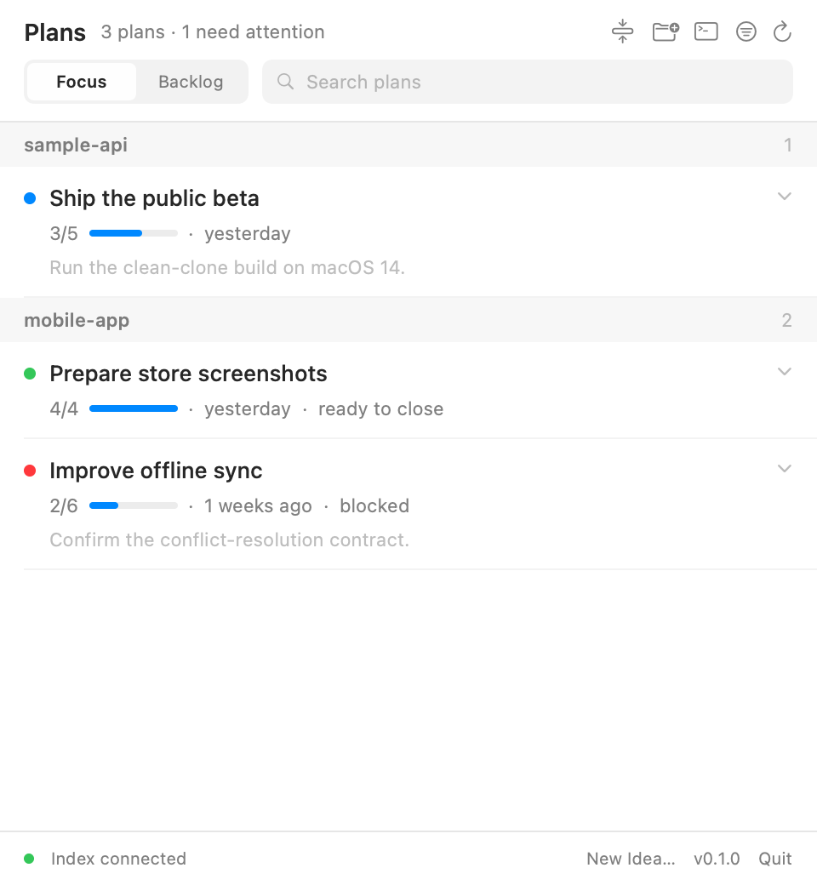
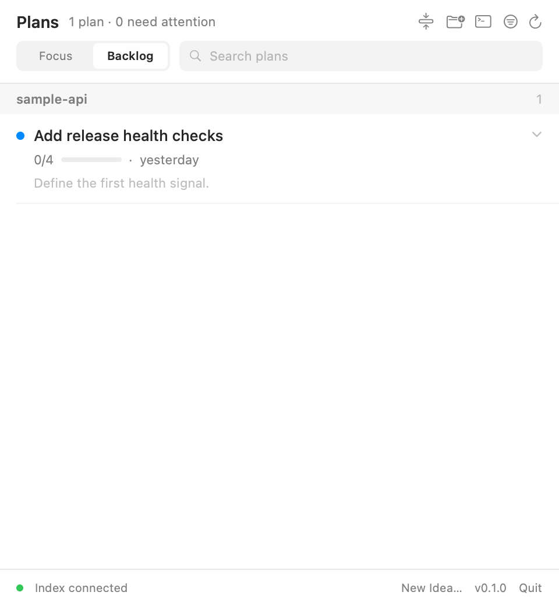

# PlansBar

[English](../../../README.md) · [Русский](../ru/README.md) · [简体中文](../zh-CN/README.md) · [Español](README.md) · [Português do Brasil](../pt-BR/README.md) · [日本語](../ja/README.md) · [한국어](../ko/README.md) · [Français](../fr/README.md) · [Deutsch](../de/README.md)

> Traducción preliminar. English is authoritative. Source docs version: 0.1.0.

PlansBar es una aplicación open source para la barra de menús de macOS. Muestra planes Markdown ejecutables de repositorios Git locales, lee los archivos sin modificarlos y delega los cambios explícitos a Codex CLI, Claude Code CLI o al portapapeles.

| Focus | Backlog |
| --- | --- |
|  |  |

Las capturas solo usan datos sintéticos de `sample-api` y `mobile-app`.

## Funciones

- Añade raíces de repositorios desde cualquier carpeta sin explorar el directorio padre.
- Usa un único formato obligatorio: Plan Format v1.
- Incluye Focus, Backlog, búsqueda global y caché local.
- Ejecuta acciones mediante prompts neutrales; la aplicación no modifica los planes.
- Sin telemetría, cuentas ni servidor web incluido.

## Instalación

Requiere macOS 14+, Git y Xcode Command Line Tools. La aplicación no necesita Node.js ni npm.

```bash
git clone https://github.com/zergzorg/plansbar.git
cd plansbar
Scripts/build-app.sh
open build/PlansBar.app
```

## Inicio rápido

1. Elige **Add Repository…** y selecciona la raíz del repositorio.
2. Conserva esta estructura interna:

```text
docs/plans/{backlog,active,completed}
```

3. Si el repositorio no está listo, copia el preparation prompt.
4. Elige Ask every time, Codex CLI, Claude Code CLI o Copy only.

Cada plan empieza con `Plan-Version: 1`. Validación por CLI:

```bash
.build/release/plansbar validate-repository --root /path/to/repository --json
```

## Privacidad y contribuciones

PlansBar guarda los datos derivados en el Mac. Antes de abrir un issue, elimina el contenido de los planes, nombres reales, rutas personales absolutas y credenciales. El README en English y el [contrato del formato](../../PLAN_FORMAT_V1.md) son la referencia.

Errores: [GitHub Issues](https://github.com/zergzorg/plansbar/issues). Versiones: [GitHub Releases](https://github.com/zergzorg/plansbar/releases). Contribuir: [CONTRIBUTING.md](../../../CONTRIBUTING.md).
